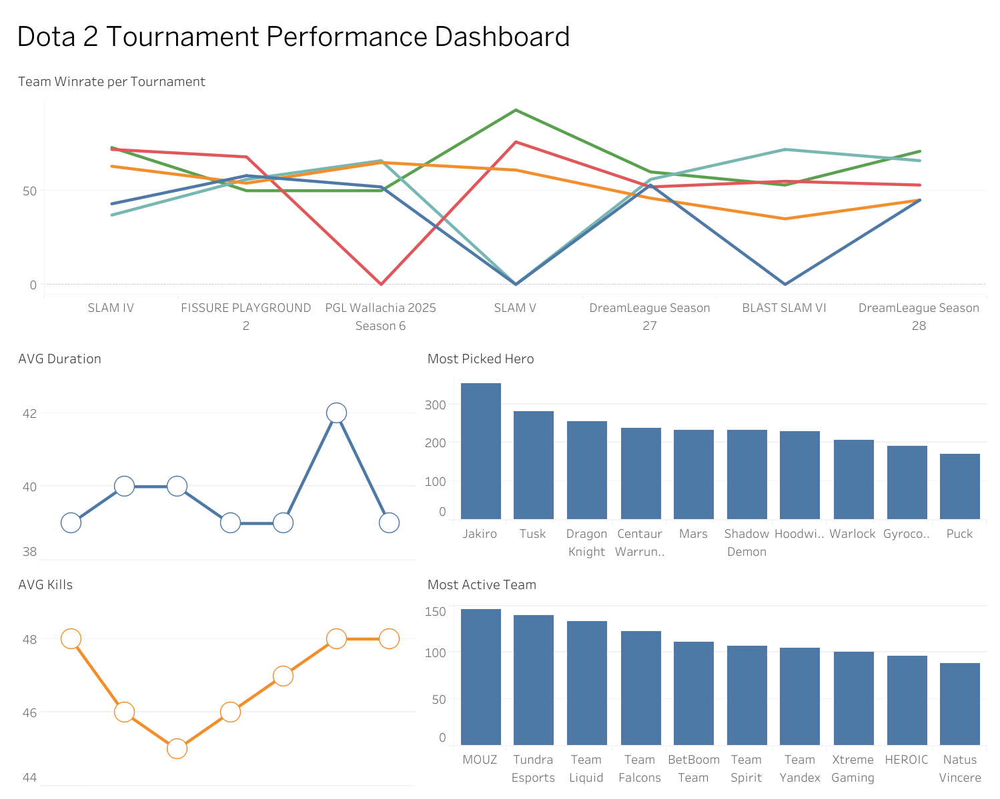

# Dota 2 Team Performance Analysis

This project analyzes professional Dota 2 matches to uncover which teams are the most active, which heroes are the most stable, and which teams have the mental resilience to throw or comeback under pressure.

---

## Why This Project

Dota 2 is more than just win rates. This project looks deeper — which teams are consistently active across tournaments, which heroes are both popular and effective, how game duration and kill trends shift over time, and which teams crack under pressure versus those who fight back.

---

## Dataset

The data used in this project covers:

- Match results (duration, kills, win/lose)
- Team information
- Hero picks
- Throw & comeback metrics
- tournament stats

> Data is limited to selected tournaments. Player-level stats, draft order, and hero synergy are not fully captured.

---

## Tools Used

- **Requests** — fetching data from OpenDota API
- **Pandas** — data processing & manipulation
- **Matplotlib & Seaborn** — static visualizations
- **Plotly** — interactive charts

---

## Analysis Breakdown

### 1. Team Performance
Calculated win rate and activity level per team to identify the most active and most consistent teams. Also analyzed aggression by looking at average kills per game to see whether aggressive teams actually win more.

### 2. Hero Analysis
Compared pick rate vs. win rate to find which heroes are genuinely effective versus just popular. Identified heroes that are both widely picked and consistently strong — like Centaur Warrunner — as well as heroes that dominate win rate charts despite lower pick counts.

### 3. Throw & Comeback Dynamics
Measured how often teams threw games or made comebacks, then created a mental score **mental score** metric:

```
mental_score = comeback_rate - throw_rate
```

Teams with a higher mental score tend to be more resilient under pressure — able to fight back even when significantly behind.

### 4. Tournament Analysis
Compared average match duration and kill counts across tournaments to understand how gameplay pace shifts between events. Tracked which tournaments trend toward faster, more aggressive play and which ones lean slower and more methodical.

### 5. Trend Analysis
Tracked win rate per team across 7 tournaments to identify which teams perform consistently regardless of the event — and which ones are heavily dependent on tournament conditions.

---

## Key Takeaways

- **Match pace is mostly Normal, but Late games are significant** — 354 matches fall in the Normal category, 288 in Fast, and 199 in Late, with an average of 47 kills per game and the most common kill range sitting between 40–50.
- **Activity ≠ consistency** — Mouz, the most active team, ranks only 8th in win rate. Meanwhile, Aurora and Parivision rarely appear in tournaments but consistently perform well when they do — suggesting they're strong contenders whenever they compete.
- **Aggression doesn't translate to wins** — Heroic leads in aggression but doesn't appear in the top 10 win rate. Teams like Yakult Brothers and Runa Team are aggressive but absent from both most active and top win rate lists.
- **Centaur Warrunner is the standout hero** — 5th most picked and 3rd highest win rate, making it both widely trusted and genuinely effective. Ember Spirit leads win rate (min. 100 picks) at ~0.5, while Invoker and Monkey King dominate at ~0.6 win rate with a lower pick threshold.
- **Most picked heroes are not the strongest** — Jakiro, Tusk, and Dragon Knight top the pick charts, but none lead the win rate rankings, reinforcing that popularity is driven more by comfort picks than actual performance.
- **DreamLeague S28 stands out** — average match duration spiked to 42 minutes compared to the ~39-minute norm. Kill trends dipped through PGL Wallachia S6 then climbed steadily through DreamLeague S28, suggesting the meta shifted toward more aggressive, action-heavy play in recent tournaments.
- **Tundra is the most consistent team** — present across all 7 tracked tournaments and finishing as the top-performing team cumulatively, making them the most reliable squad in the dataset.
- **Natus Vincere has the strongest mental resilience** — leading the top 10 comeback rate with a notably high rate, showing the team's ability to recover even when significantly behind. In contrast, Tidebound leads throw rate, indicating a tendency to lose despite advantageous positions.

---

## Sample Visualization



---

## How to Run

```bash
git clone https://github.com/chokiarmando-lab/dota2-team-performance-analysis.git
cd dota2-team-performance-analysis
jupyter notebook
```

---

## Author

**Choki Armando**